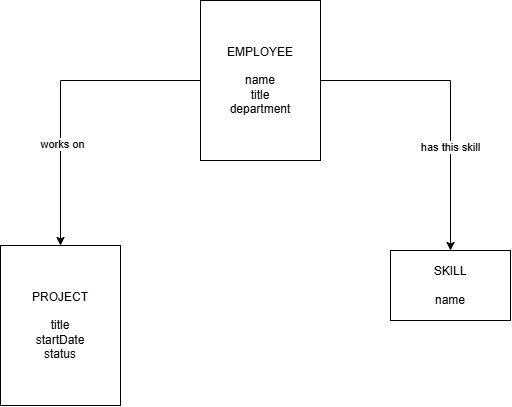
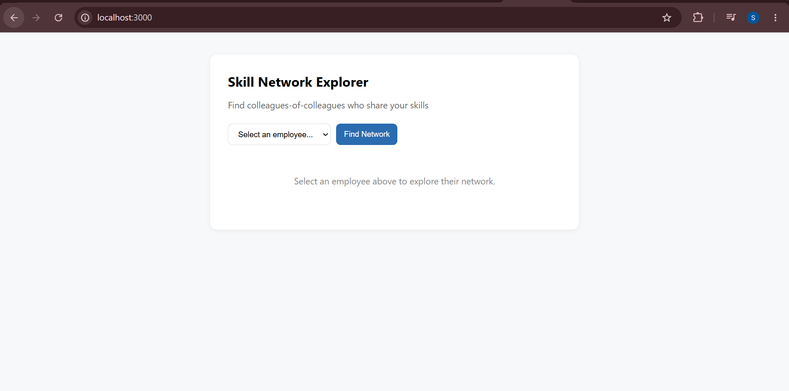
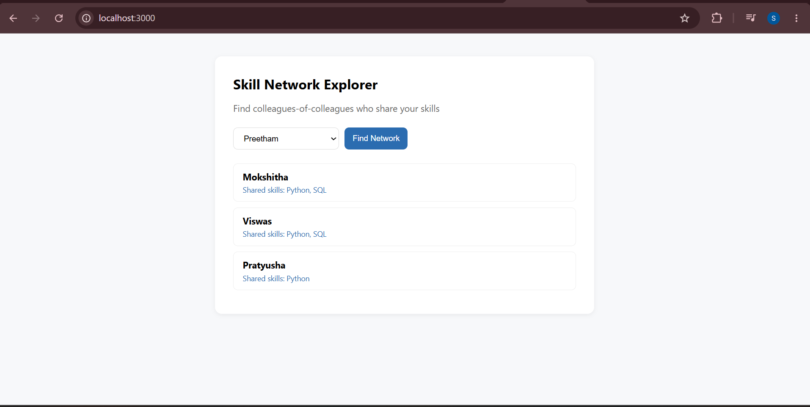
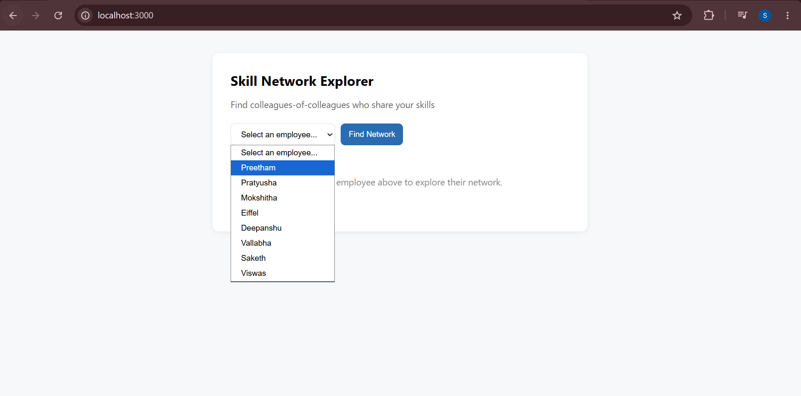

# Skill Network Explorer

A graph-powered web application that helps employees explore their extended professional network and discover colleagues-of-colleagues who share similar skills.

Powered by CognoDB and Cypher queries.

---

## Overview

Skill Network Explorer is a full-stack application built to demonstrate how graph databases can model and query complex relationships.

The application allows a user to select an employee and discover people in their extended professional network who share one or more skills with them.

Instead of storing relationships as simple rows and repeatedly joining tables, the application models employees, projects, and skills as connected graph entities.

---

## Use Case

In an organization, employees may work on different projects and possess different skills. Finding indirect professional connections and discovering people with shared skills can become difficult when the relationships span multiple teams and projects.

Skill Network Explorer helps users explore these relationships by finding colleagues-of-colleagues who are indirectly connected through shared projects and who also share one or more skills.

This can be useful for collaboration discovery, team building, internal networking, and identifying employees with relevant technical expertise.

---

## Why a Graph Database?

Graph databases are well suited for this application because relationships between employees, projects, and skills are the most important part of the data.

In this application, employees are connected to projects through `WORKS_ON` relationships and to skills through `HAS_SKILL` relationships. The application can traverse multiple relationships to discover indirect connections.

A query such as finding a colleague-of-a-colleague who shares a skill requires multiple relationship traversals. In a relational database, this would typically require multiple JOIN operations or recursive queries. With Cypher and a graph database, these relationships can be expressed naturally and clearly as graph patterns.

Graph databases are especially useful for multi-hop relationship queries because connected data can be traversed directly through relationships.

---

## Data Model



### Node Types

#### Employee

Represents a person working in the organization.

**Properties:**

- `name`
- `title`
- `department`

Example:

```text
Employee
├── name: Preetham
├── title: Backend Engineer
└── department: Engineering
```

#### Project

Represents a project within the organization.

**Properties:**

- `title`
- `startDate`
- `status`

Example:

```text
Project
├── title: Checkout Revamp
├── startDate: 2026-01-10
└── status: Active
```

#### Skill

Represents a professional or technical skill.

**Properties:**

- `name`

Example:

```text
Skill
└── name: Python
```

---

## Relationship Types

The application uses the following graph relationships:

```text
(Employee)-[:WORKS_ON]->(Project)
```

Represents an employee working on a project.

```text
(Employee)-[:HAS_SKILL]->(Skill)
```

Represents a skill possessed by an employee.

```text
(Employee)-[:MANAGES]->(Employee)
```

Represents a management relationship between employees.

---

## Graph Structure

The graph supports multi-hop traversal between employees through projects.

A simplified relationship path is:

```text
(Employee)
     │
     │ WORKS_ON
     ▼
(Project)
     ▲
     │ WORKS_ON
     │
(Colleague)
     │
     │ WORKS_ON
     ▼
(Another Project)
     ▲
     │ WORKS_ON
     │
(Colleague of Colleague)
```

The application then checks whether the original employee and the colleague-of-colleague share a common skill.

```text
(Employee)
     │
     │ HAS_SKILL
     ▼
(Skill)
     ▲
     │ HAS_SKILL
     │
(Colleague of Colleague)
```

This enables a multi-hop graph traversal.

---

## Application Architecture

```text
User
 │
 ▼
Frontend
 │
 │ HTTP Request
 ▼
Express Backend API
 │
 │ Cypher Query
 ▼
CognoDB Graph Database
 │
 ▼
Query Results
 │
 ▼
Frontend UI
```

---

## Technologies Used

- Node.js
- Express.js
- JavaScript
- HTML
- CSS
- Neo4j JavaScript Driver
- CognoDB
- Cypher
- Git
- GitHub

---

## Project Structure

```text
weka-assessment/
│
├── backend/
│   ├── routes/
│   │   └── employees.js
│   ├── db.js
│   └── server.js
│
├── frontend/
│   ├── index.html
│   ├── style.css
│   └── script.js
│
├── scripts/
│   ├── seed.js
│   └── testQueries.js
│
├── docs/
│   └── data-model.png
│
├── screenshots/
│   ├── home.png
│   ├── results.png
│   └── empty-state.png
│
├── .env
├── .gitignore
├── package.json
└── README.md
```

---

## Setup and Installation

### 1. Clone the Repository

```bash
git clone YOUR_GITHUB_REPOSITORY_URL
```

Move into the project folder:

```bash
cd weka-assessment
```

---

### 2. Install Dependencies

Run:

```bash
npm install
```

This installs the required Node.js packages.

---

### 3. Create a CognoDB Instance

Create a CognoDB Cloud instance and obtain the required connection details.

The application requires:

- CognoDB connection URI
- Database username
- Database password

---

### 4. Configure Environment Variables

Create a `.env` file in the root directory of the project.

Add the following:

```env
COGNODB_URI=your_cognodb_connection_uri
COGNODB_USER=your_username
COGNODB_PASSWORD=your_password
```

Do not upload your actual credentials to GitHub.

Make sure `.env` is included in `.gitignore`.

Example:

```text
node_modules/
.env
```

---

### 5. Seed the Database

Run the seed script:

```bash
node scripts/seed.js
```

This script creates and loads the sample employees, projects, skills, and relationships into CognoDB.

---

### 6. Test the Queries

Run:

```bash
node scripts/testQueries.js
```

This can be used to verify that the graph queries are working correctly.

---

### 7. Start the Application

Run:

```bash
npm start
```

Open the application using the URL displayed in the terminal.

---

## Main Graph Queries

### 1. Retrieve Employees and Their Skills

```cypher
MATCH (e:Employee)-[:HAS_SKILL]->(s:Skill)
RETURN e.name AS employee, collect(s.name) AS skills
```

This query retrieves all employees and their associated skills. The results are used to populate the employee selection dropdown in the application.

---

### 2. Extended Network Query

```cypher
MATCH (me:Employee {name: $myName})-[:WORKS_ON]->(:Project)<-[:WORKS_ON]-(colleague:Employee)
WHERE colleague <> me

MATCH (colleague)-[:WORKS_ON]->(:Project)<-[:WORKS_ON]-(colOfCol:Employee)
WHERE colOfCol <> me AND colOfCol <> colleague

MATCH (me)-[:HAS_SKILL]->(sharedSkill:Skill)<-[:HAS_SKILL]-(colOfCol)

RETURN DISTINCT
    colOfCol.name AS person,
    collect(DISTINCT sharedSkill.name) AS sharedSkills
```

This is the main graph traversal query used by the application.

It starts with a selected employee, finds colleagues through shared projects, then traverses another level to find colleagues-of-colleagues.

Finally, it identifies people in the extended network who share one or more skills with the selected employee.

This demonstrates a multi-hop graph traversal.

---

## API Endpoints

### Get Employees

```text
GET /api/employees
```

Returns employees and their associated skills.

### Get Extended Network

```text
GET /api/employees/:name/extended-network
```

Example:

```text
GET /api/employees/Asha/extended-network
```

Returns colleagues-of-colleagues who share skills with the selected employee.

---

## User Interface

The application allows users to:

1. Select an employee.
2. Click the **Find Network** button.
3. Discover colleagues-of-colleagues.
4. View the skills shared with each result.

The application also handles:

- Loading states
- Empty results
- Server errors
- Invalid selections

---

## Screenshots

### Home Page



### Network Results



### Employees



---


---

## Future Improvements

Possible future improvements include:

- Visual graph representation
- Employee search functionality
- Project filtering
- More advanced multi-hop traversal queries
- Employee management hierarchy visualization
- Network analytics and insights

---

## Author

Shashi Preetham Thati

---

## License

This project was created as part of a CognoDB full-stack graph database assessment.